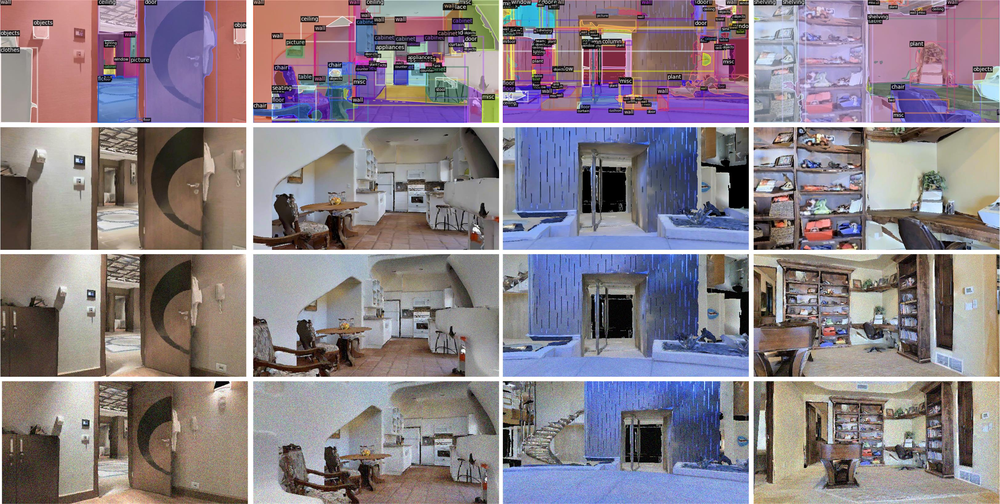

# HISNav
`HISNav` - Habitat-based Instance segmentation, Slam and Navigation Dataset

**The dataset is available [here](https://drive.google.com/drive/folders/1p2Up5gtpREWQmbvPlzcPtPf_wYUiFjpY?usp=sharing).**

## Models
For your convenience, we provide the following trained models on COCO (more models are coming soon).

Model | Testing time / im | mAP (IoU=0.5) | Link
--- |:---:|:---:|:---:
BlendMask | 20ms | 39.1 | [download](https://cloudstor.aarnet.edu.au/plus/s/61WDqq67tbw1sdw/download)
SOLOv2 | 18ms | 37.5 | [download](https://cloudstor.aarnet.edu.au/plus/s/nkxN1FipqkbfoKX/download)
YOLACT++ | 26ms | 39.1 | [download](https://cloudstor.aarnet.edu.au/plus/s/61WDqq67tbw1sdw/download)
MASK R-CNN_{det2} | 31ms | 41.4 | [download](https://cloudstor.aarnet.edu.au/plus/s/4ePTr9mQeOpw0RZ/download)
MASK R-CNN_{mmdet} | 34ms | 42.4 | [download](https://cloudstor.aarnet.edu.au/plus/s/KV9PevGeV8r4Tzj/download)


`HISNav` is a dataset, which consists of various robot movements tracks, recorded in virtual environment Habitat. Tracks were built on 49 unique scenes from [Matterport3D](https://niessner.github.io/Matterport/) that present rooms with different styles. Each scene has no more than 5 trajectories with 3 different levels of noise in camera images and in actions.

We pursue the goal to research the steadiness of the developed framework to the noise. We use three levels of noise in images: without noise, light Gaussian noise , strong Gaussian noise. The examples of images from the dataset are shown here:



*Solov2's predictions:*


Each RGB image has a resolution 640x320, and the depth map has the same resolution. Each pixel contains a distance value in meters (from 0 to 100m). Ground truth instance labels of 40 classes (wall, floor, chair, door, table, sofa, etc.) correspond to each image. 

All the dataset includes 135962 images and is split ted into three parts: train, val and test. Information about splitted samples can be found in Table. While splitting into samples a goal of diversity and balance between training, validation and test samples was pursued.

|                                            | train  | val    | test   | total  |
|--------------------------------------------|--------|--------|--------|--------|
| Number of images                           | 72626  | 27952  | 35384  | 135962 |
| Number of unique scenes                    |     49 |     35 |     43 |        |
| Number of tracks                           |     88 |     35 |     43 |        |

The dataset is distributed in `hdf5` file format. To extract the data in TUM format for the purpose of evaluation Visual SLAM methods we provide a script `tools/HISNav_to_TUM.ipynb`

<!---
  **Number of instances per class (40 classes)**
|                                            | train  | val    | test   | total  |
|--------------------------------------------|--------|--------|--------|--------|
| wall                                       | 420782 | 171545 | 231628 | 823955 |
| floor                                      | 181355 |  73785 |  94042 | 349182 |
| chair                                      | 153759 |  54164 |  59711 | 267634 |
| door                                       | 228804 |  83998 | 103098 | 415900 |
| table                                      |  76787 |  33727 |  37339 | 147853 |
| picture                                    |  80842 |  31947 |  39932 | 152721 |
| cabinet                                    |  37649 |  18275 |  21674 |  77598 |
| cushion                                    |  47449 |  25205 |  23442 |  96096 |
| window                                     | 110639 |  35525 |  54558 | 200722 |
| sofa                                       |  24254 |  10277 |  10999 |  45530 |
| bed                                        |  19651 |   8117 |  10491 |  38259 |
| curtain                                    |  45786 |  14236 |  16187 |  76209 |
| chest_of_drawers                           |  16311 |   5817 |   8023 |  30151 |
| plant                                      |  36286 |  19104 |  27240 |  82630 |
| sink                                       |   7002 |   3014 |   3275 |  13291 |
| stairs                                     |  19337 |   6359 |  11485 |  37181 |
| ceiling                                    | 139829 |  55721 |  81929 | 277479 |
| toilet                                     |   1948 |   1219 |   1444 |   4611 |
| stool                                      |  14721 |   6572 |   9056 |  30349 |
| towel                                      |   6082 |   3201 |   4642 |  13925 |
| mirror                                     |  14857 |   5987 |   6692 |  27536 |
| tv_monitor                                 |  13440 |   5357 |   8471 |  27268 |
| shower                                     |   5987 |   1166 |   1726 |   8879 |
| column                                     |  31210 |  11130 |  10720 |  53060 |
| bathtub                                    |   3854 |   1465 |   1571 |   6890 |
| counter                                    |  15917 |   6626 |   9077 |  31620 |
| fireplace                                  |   7218 |   2337 |   1960 |  11515 |
| lighting                                   |  33907 |   9153 |  15949 |  59009 |
| beam                                       |   5514 |   1490 |   3183 |  10187 |
| railing                                    |  23927 |   9405 |  12778 |  46110 |
| shelving                                   |  22927 |  11515 |  14981 |  49423 |
| blinds                                     |   2150 |    782 |   1061 |   3993 |
| gym_equipment                              |    868 |    372 |    495 |   1735 |
| seating                                    |  19521 |   4747 |   7178 |  31446 |
| board_panel                                |   1498 |     67 |    398 |   1963 |
| furniture                                  |   3140 |    967 |   1277 |   5384 |
| appliances                                 |   7839 |   2691 |   3745 |  14275 |
| clothes                                    |    586 |    561 |    634 |   1781 |
| objects                                    | 113931 |  45902 |  59614 | 219447 |
| misc                                       | 223810 |  87047 | 126577 | 437434 |
-->

# Visualize the results

```shell
python tools/vis_pred_json.py 
```
